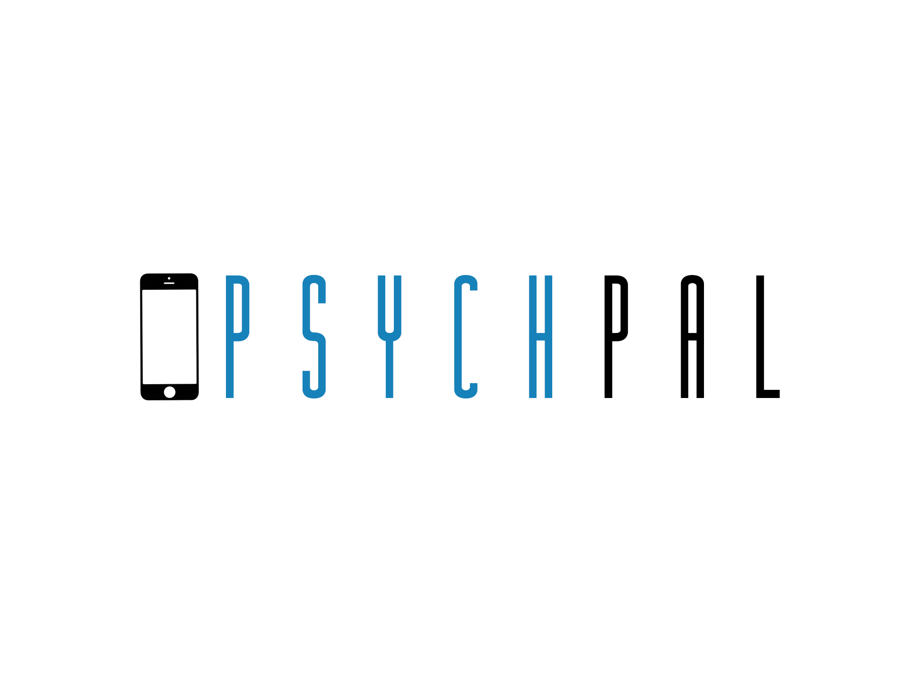

<!-- PROJECT LOGO -->
<br />
<p align="center">
  <a href="https://github.com/othneildrew/Best-README-Template">
    
  </a>

  <h3 align="center">PsychPal</h3>

  <p align="center">
    IBM Call for Code 2019 Global Challenge
    <br />
    <br />
    <a href="https://www.youtube.com/watch?v=IZW6IxCt-XQ&feature=youtu.be">View Video Demo</a>
    ·
    <a href="https://github.com/DivineDX/CallForCode-Telehealth/issues">Report Bug</a>
    ·
    <a href="https://github.com/DivineDX/CallForCode-Telehealth/issues">Request Feature</a>
  </p>
</p>


<!-- TABLE OF CONTENTS -->
## Table of Contents

* [About the Project](#about-the-project)
  * [Built With](#built-with)
* [Getting Started](#getting-started)
  * [Prerequisites](#prerequisites)
  * [Installation](#installation)
* [Usage](#usage)
* [Roadmap](#roadmap)
* [Contributing](#contributing)
* [License](#license)
* [Contact](#contact)
* [Acknowledgements](#acknowledgements)


<!-- ABOUT THE PROJECT -->
## About The Project

PsychPal is a tech solution which aims to overcome the aftermaths of natural disasters in the world. Many victims of natural disasters go on to develop mental illnesses such as depression, PTSD, anxiety issues etc. Yet, most of them do not get to seek treatment due to three big reasons - financial cost, geographical inaccessibility and social stigma associated with mental illnesses. PsychPal, which takes the form of a cross-platform mobile app, acts as a virtual clinic which is able to write off the three factors mentioned and make treatment accessible to patients all over the world. 

The team at PsychPal aims to launch PsychPal as a Non-Profit Organisation, providing complimentary/subsidised TelePsychiatry services to patients suffering from mental disorders. We have submitted PsychPal for IBM Call for Code 2019 Global Challenge.

### Built With

Tech Stack:
* React Native
* Node
* Express
* MySQL

IBM Cloud Service:
* IBM Cloud Object Storage

Open Source Solutions and/or Libraries:
* React Native Elements
* Native Base
* Jitsi Meet

<!-- GETTING STARTED -->
## Getting Started

This instruction guide will help you get the app running on your local machine.

### Prerequisites

* React Native 0.59 environment - Please refer to React Native Docs here for the setup
* MySQL server on your local machine

### Installation and Running App in Development Mode

1. Clone the repo
```sh
git clone https://github.com/DivineDX/CallForCode-Telehealth.git
```
2. Change your directory to ./PsychPal/frontendapp. This contains our React Native mobile application files built using React Native CLI.  <a href="https://facebook.github.io/react-native/docs/getting-started.html">Please ensure that you set-up the development environment</a>

3. Install NPM Packages
```sh
npm install or yarn install
```
4. Start the RN App.
```sh
react-native run-ios OR react-native run-android
Important Note: If you encounter "Error: Unable to resolve module `./index`", open one window to run react-native start -- --reset-cache first before running opening another window to run react-native run-ios or react-native run-android
```
5. Change your directory to ./Psychpal/server and install NPM Packages
```sh
npm install or yarn install
```

6. Dump the PsychPal.sql file in this folder to your own MySQL server. <a href="https://alvinalexander.com/blog/post/mysql/how-restore-mysql-database-from-backup-file">You may follow this guide for reference</a>

8. Modify lines 6-11 of server.js according to your local MySQL configuration

9. Start the backend server 
```sh
npm start or yarn start
```

10. Change your directory to ./PsychPal/backend-ibm and install NPM Packages
```sh
npm install or yarn install
```
11. Start the ibm backend server 
```sh
npm start or yarn start
```

<b>Configuration:</b>
1. Backend Connection
```sh
Go to ./PsychPal/frontendapp/DatabaseInteraction/Connection.js

If running on iOS, ensure that line 5 (connection: '10.0.2.2') is commented out and line 6 (connection: 'localhost') is uncommented out
If running on Android, do the opposite - ensure that line 5 (connection: '10.0.2.2') is uncommented out and line 6 (connection: 'localhost') is commented out
```

2. MySQL Configuration
```sh
Go to ./PsychPal/server/server.js
Modify lines 6-11 according to your local MySQL configuration
```

<!-- USAGE EXAMPLES -->
## Usage

As of 29 July 2019, PsychPal (Patient UI) is available for public trial usage for both Android and iOS users. For a product walkthrough and demo to familiarise with the workings of the mobile app, please <a href="https://www.youtube.com/watch?v=IZW6IxCt-XQ&feature=youtu.be">view our video demo.</a>


<!-- ROADMAP -->
## Roadmap

PsychPal's roadmap from July 2019 till the end of 2019, is available for viewing <a href="https://github.com/DivineDX/PsychPal/blob/workingApp/PsychPalRoadmap.png">here</a>.

<!-- CONTRIBUTING -->
## Contributing

PsychPal is open source under MIT License. All feedback sent to us will be taken into serious consideration. 
To send us a feedback, please raise a "new issue" under the issues tab of this repository, with a suitable title and label.

<!-- CONTACT -->
## Contact

Please raise a "new issue" under the issues tab of this repository, the team at PsychPal promises to respond to your enquiries as soon as possible.


<!-- ACKNOWLEDGEMENTS -->
## Acknowledgements

* Matthias, our video producer who championed the whole video production process for our Video Demo
* IBM, for giving us the opportunity to work on this project and also for providing access to IBM Cloud Services
